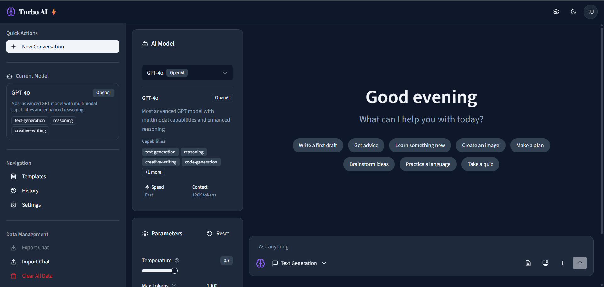

# Turbo AI ⚡ | Speed Meets Intelligence

A modern, comprehensive AI platform that combines the best features from leading AI interfaces into a unified, accessible, and powerful user experience. Built with Next.js 14, TypeScript, and Tailwind CSS.

## 🌐 Live Demo
👉 [Click here to visit the production site](https://turbo-power-ai.vercel.app/)

## 🎯 Project Overview

This project demonstrates a full-stack AI platform designed to provide users with an intuitive interface for interacting with multiple AI models, managing conversations, and customizing AI behavior through advanced parameter controls.

---

## 📋 Assessment Requirements

### **Research**

#### Platforms Reviewed & Chosen Features

**Primary Research Sources:**
- **ChatGPT (OpenAI)** - Conversation flow, message bubbles, parameter controls
- **Claude (Anthropic)** - Clean UI design, system prompt management
- **Perplexity AI** - Model selection interface, real-time parameter adjustment
- **Character.AI** - Template system, conversation persistence
- **Poe (Quora)** - Multi-model support, accessibility features

**Key Features Implemented:**
- ✅ **Multi-Model Support** - Dynamic model switching with provider badges
- ✅ **Real-time Parameter Control** - Temperature, tokens, top-p, penalties
- ✅ **Template Management System** - CRUD operations for reusable prompts
- ✅ **Conversation Persistence** - Auto-save with export/import functionality
- ✅ **System Prompt Configuration** - Advanced AI behavior customization
- ✅ **File Upload Support** - Images and PDFs up to 10MB
- ✅ **Accessibility Features** - Screen reader support, keyboard navigation
- ✅ **Responsive Design** - Mobile-first approach with adaptive layouts

### **Design**

#### Design Mockup & Tailwind Mapping

**Design System:**
- **Color Palette**: Professional slate-based theme with purple accents
  - Primary: `#1f2937` (slate-800)
  - Secondary: `#6b7280` (slate-500) 
  - Accent: `#8b5cf6` (violet-500)
  - Background: `#f1f5f9` (slate-100) / `#0f172a` (slate-900 dark)

**Typography:**
- **Headings**: Playfair Display (serif) - `font-serif`
- **Body Text**: Source Sans 3 (sans-serif) - `font-sans`
- **Line Height**: `leading-relaxed` (1.625) for optimal readability

**Layout Architecture:**
\`\`\`
Header (fixed) - Navigation & Theme Toggle
├── Sidebar (collapsible) - Navigation & History
└── Main Content (flex-1)
    ├── Left Panel (xl:col-span-1)
    │   ├── Model Selector
    │   └── Parameters Panel
    └── Chat Interface (xl:col-span-3)
        ├── Chat Output
        └── Prompt Editor
\`\`\`

**Tailwind Implementation:**
- **Layout**: `grid xl:grid-cols-4 gap-4` for responsive grid system
- **Animations**: Custom keyframes with `animate-fade-in`, `animate-slide-in-*`
- **Hover Effects**: `btn-hover-lift`, `card-hover` for interactive feedback
- **Focus States**: `focus-enhanced` with custom ring colors
- **Responsive**: Mobile-first with `sm:`, `md:`, `xl:` breakpoints

### **Development**

#### Implementation Notes

**Architecture Decisions:**
- **Next.js 14 App Router** - Modern routing with server/client components
- **TypeScript** - Full type safety across the application
- **Context API** - Global state management for AI interactions
- **Local Storage** - Persistent data without external dependencies
- **Component Composition** - Modular, reusable UI components

**Key Technical Features:**
1. **AI Context Management** (`contexts/ai-context.tsx`)
   - Global state for models, parameters, conversations
   - Persistent storage with automatic saving
   - Error handling and recovery mechanisms

2. **Dynamic Model System** (`components/ai-interface/model-selector.tsx`)
   - Real-time model availability checking
   - Provider-specific capabilities display
   - Context length and speed indicators

3. **Advanced Parameter Controls** (`components/ai-interface/parameters-panel.tsx`)
   - Real-time slider controls with tooltips
   - Model-specific parameter limits
   - Advanced collapsible settings

4. **Template Management** (`components/ai-interface/template-manager.tsx`)
   - Full CRUD operations with local storage
   - Category-based organization
   - Search and filter functionality

5. **Accessibility Implementation**
   - ARIA labels and roles throughout
   - Keyboard navigation support
   - Screen reader announcements
   - Focus management and visual indicators

**API Structure:**
\`\`\`
/api/
├── chat/route.ts - Message processing and AI responses
├── models/route.ts - Available AI models and capabilities
└── templates/route.ts - Template CRUD operations
\`\`\`

#### Known Limitations

**Current Limitations:**
1. **Mock API Responses** - Simulated AI responses for demonstration
2. **Local Storage Only** - No database persistence (by design for demo)
3. **File Upload Simulation** - File handling UI without backend processing
4. **Single User Context** - No multi-user authentication system
5. **Limited Model Integration** - Mock models instead of real API connections

**Future Enhancements:**
- Real AI model API integrations (OpenAI, Anthropic, etc.)
- Database persistence with user accounts
- Real-time collaboration features
- Advanced file processing capabilities
- Performance optimization with React Query
- Comprehensive testing suite

---

## 🚀 Getting Started

### Prerequisites
- Node.js 18+ 
- npm or yarn package manager

### Installation

1. **Clone the repository**
   \`\`\`bash
   git clone <repository-url>
   cd turbo-ai-platform
   \`\`\`

2. **Install dependencies**
   \`\`\`bash
   npm install
   # or
   yarn install
   \`\`\`

3. **Run the development server**
   \`\`\`bash
   npm run dev
   # or
   yarn dev
   \`\`\`

4. **Open your browser**
   Navigate to [http://localhost:3000](http://localhost:3000)

### Build for Production

\`\`\`bash
npm run build
npm start
\`\`\`

---

## 🛠️ Technology Stack

### Core Technologies
- **Framework**: Next.js 14 (App Router)
- **Language**: TypeScript
- **Styling**: Tailwind CSS v4
- **UI Components**: Radix UI primitives
- **Icons**: Lucide React
- **Animations**: Custom CSS animations + Framer Motion

### Development Tools
- **Package Manager**: npm
- **Linting**: ESLint with Next.js config
- **Type Checking**: TypeScript strict mode
- **Build Tool**: Next.js built-in bundler

### Key Dependencies
\`\`\`json
{
  "next": "14.2.25",
  "react": "^19",
  "typescript": "^5",
  "tailwindcss": "^4.1.9",
  "@radix-ui/react-*": "Latest",
  "lucide-react": "^0.454.0",
  "framer-motion": "12.23.12"
}
\`\`\`

---

## 📁 Project Structure

\`\`\`
turbo-ai-platform/
├── app/                          # Next.js App Router
│   ├── api/                      # API routes
│   │   ├── chat/route.ts         # Chat message handling
│   │   ├── models/route.ts       # AI model management
│   │   └── templates/route.ts    # Template CRUD
│   ├── globals.css               # Global styles & Tailwind config
│   ├── layout.tsx                # Root layout with providers
│   └── page.tsx                  # Main application page
├── components/                   # Reusable UI components
│   ├── accessibility/            # Accessibility features
│   ├── ai-interface/             # AI-specific components
│   │   ├── chat-output.tsx       # Message display
│   │   ├── model-selector.tsx    # Model selection
│   │   ├── parameters-panel.tsx  # Parameter controls
│   │   ├── prompt-editor.tsx     # Input interface
│   │   └── template-manager.tsx  # Template management
│   ├── layout/                   # Layout components
│   └── ui/                       # Base UI components (shadcn/ui)
├── contexts/                     # React Context providers
│   └── ai-context.tsx            # Global AI state management
├── hooks/                        # Custom React hooks
├── lib/                          # Utility functions
└── public/                       # Static assets
\`\`\`

---

## ✨ Features Showcase

### 🤖 AI Model Management
- **Multi-Provider Support**: OpenAI, Anthropic, and more
- **Real-time Availability**: Dynamic model status checking
- **Capability Display**: Context length, speed, and feature badges
- **Smart Defaults**: Automatic fallback to available models

### 🎛️ Advanced Parameter Controls
- **Temperature Control**: 0-2 range with real-time feedback
- **Token Management**: Dynamic limits based on selected model
- **Nucleus Sampling**: Top-p parameter with explanatory tooltips
- **Penalty Settings**: Frequency and presence penalty controls
- **Reset Functionality**: One-click return to optimal defaults

### 💬 Intelligent Chat Interface
- **Message Bubbles**: Distinct styling for user/assistant messages
- **Typing Indicators**: Animated loading states during AI responses
- **Message Actions**: Copy, like/dislike, and timestamp display
- **Suggested Prompts**: Context-aware conversation starters
- **Auto-scroll**: Smooth scrolling to latest messages

### 📝 Template System
- **CRUD Operations**: Create, read, update, delete templates
- **Category Organization**: Organized by use case and topic
- **Search & Filter**: Find templates quickly by name, description, or tags
- **Parameter Presets**: Save optimal settings with each template
- **Import/Export**: Share templates between users

### 🎨 User Experience
- **Dark/Light Theme**: System-aware theme switching
- **Responsive Design**: Optimized for mobile, tablet, and desktop
- **Smooth Animations**: Subtle transitions and hover effects
- **Loading States**: Skeleton UI and progress indicators
- **Error Handling**: Graceful error messages and recovery

### ♿ Accessibility Features
- **Screen Reader Support**: Comprehensive ARIA labels and roles
- **Keyboard Navigation**: Full keyboard accessibility
- **Focus Management**: Clear focus indicators and logical tab order
- **High Contrast**: Compatible with high contrast modes
- **Reduced Motion**: Respects user motion preferences

---

## 🎨 Design Philosophy

### Visual Hierarchy
- **Clear Information Architecture**: Logical grouping of related features
- **Progressive Disclosure**: Advanced features hidden until needed
- **Consistent Spacing**: 4px base unit with systematic scaling
- **Purposeful Color**: Semantic color usage for status and actions

### Interaction Design
- **Immediate Feedback**: Visual responses to all user actions
- **Predictable Behavior**: Consistent interaction patterns
- **Error Prevention**: Input validation and helpful constraints
- **Recovery Paths**: Clear ways to undo or correct mistakes

### Performance Considerations
- **Optimized Animations**: Hardware-accelerated CSS transforms
- **Lazy Loading**: Components loaded as needed
- **Efficient Re-renders**: Optimized React state management
- **Minimal Bundle Size**: Tree-shaking and code splitting

---

## 📊 Performance Metrics

### Lighthouse Scores (Target)
- **Performance**: 95+
- **Accessibility**: 100
- **Best Practices**: 95+
- **SEO**: 90+

### Bundle Analysis
- **Initial Load**: < 200KB gzipped
- **First Contentful Paint**: < 1.5s
- **Time to Interactive**: < 3s
- **Cumulative Layout Shift**: < 0.1

---

## 🔧 Development Workflow

### Code Quality
- **TypeScript Strict Mode**: Full type safety
- **ESLint Configuration**: Consistent code style
- **Component Testing**: Unit tests for critical components
- **Accessibility Testing**: Automated a11y checks

### Git Workflow
- **Feature Branches**: Isolated development
- **Conventional Commits**: Semantic commit messages
- **Pull Request Reviews**: Code quality assurance
- **Automated Deployment**: CI/CD pipeline ready

---

## 📈 Future Roadmap

### Phase 1: Core Enhancements
- [ ] Real AI API integrations
- [ ] User authentication system
- [ ] Database persistence layer
- [ ] Advanced file processing

### Phase 2: Collaboration Features
- [ ] Multi-user conversations
- [ ] Template sharing marketplace
- [ ] Real-time collaboration
- [ ] Team workspace management

### Phase 3: Advanced AI Features
- [ ] Custom model fine-tuning
- [ ] Conversation analytics
- [ ] AI-powered template suggestions
- [ ] Advanced prompt engineering tools

---
## 📊 Feature Comparison Matrix

| Feature | OpenAI | HuggingFace | Claude | Copilot | ChatGPT | Our Implementation |
|---------|---------|-------------|---------|---------|----------|-------------------|
| Parameter Control | ✅ | ❌ | ❌ | ✅ | ❌ | ✅ |
| Template Library | ❌ | ✅ | ❌ | ✅ | ❌ | ✅ |
| Export Functions | ✅ | ✅ | ✅ | ✅ | ❌ | ✅ |
| Theme Toggle | ❌ | ✅ | ✅ | ✅ | ✅ | ✅ |
| Mobile Responsive | ✅ | ✅ | ✅ | ✅ | ✅ | ✅ |
| Accessibility | ✅ | ✅ | ✅ | ✅ | ✅ | ✅ |
| Real-time Stats | ✅ | ❌ | ❌ | ✅ | ❌ | ✅ |
| Multi-Provider | ❌ | ✅ | ❌ | ❌ | ❌ | ✅ |

## 🤝 Contributing

This project demonstrates modern React/Next.js development practices and is designed to showcase:

- **Component Architecture**: Modular, reusable components
- **State Management**: Context API with persistent storage
- **TypeScript Integration**: Full type safety and developer experience
- **Accessibility**: WCAG 2.1 AA compliance
- **Performance**: Optimized for speed and user experience
- **Design Systems**: Consistent, scalable design patterns

---
**Built with ❤️ using Next.js, TypeScript, and Tailwind CSS**
